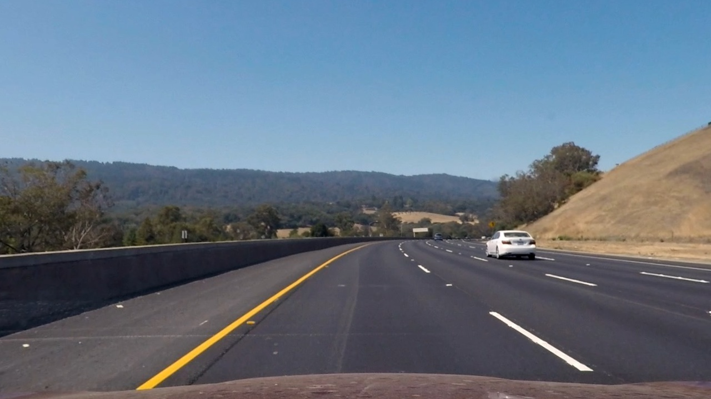

## Advanced Lane Finding

### Goal
Goal of this project is to find lane lines in more complex scenario. And in this project, we calculate curvature of the lane.

---

### Overall Process
Captured image files are processed as follows:

1. Compute the camera calibration matrix and distortion coefficients given a set of chessboard images.
2. Apply a distortion correction to raw images.
3. Use color transforms, gradients, etc., to create a thresholded binary image.
4. Apply a perspective transform to rectify binary image ("birds-eye view").
5. Detect lane pixels and fit to find the lane boundary.
6. Determine the curvature of the lane and vehicle position with respect to center.
7. Warp and overay lane boundaries to the original image.
8. Process against video sequence with some filtering


---

## Writeup

### 1. Camera Calibration
In order to calculate distortion parameter, I used chessboard images, which has known size. We can get correlation of the coordinates between image plane (x, y) with world coordinates (x, y, z) by assuming the chessboard is fixed on the (x, y) plane at z=0. 

I then used the output `objpoints` (3D points in the real world) and `imgpoints` (2D points in image plane) to compute the camera calibration and distortion coefficients using the `cv2.calibrateCamera()` function.  I applied this distortion correction to the test image using the `cv2.undistort()` function and obtained this result: 

<table>
	<tr>
		<td> 
			</img> 
			<p align="center"> before </p>
		</td>
		<td>
			</img>
			<p align="center"> after </p>
		</td>
	</tr>
</table>

### Pipeline (single images)

#### 2. Distortion Correction on example image
At the first step of this pipeline, I applied distortion correction on the image. I defined `distortion_correction()` which just use `cv2.undistort()` as explained in camera calibration.

```python
def distortion_correction(img, mtx, dist):
    return cv2.undistort(img, mtx, dist, None, mtx)
```


<table>
	<tr>
		<td> 
			</img> 
			<p align="center"> before </p>
		</td>
		<td>
			</img>
			<p align="center"> after </p>
		</td>
	</tr>
</table>


#### 3. Color & Gradient Threshold

Now that we could get undistorted image, let's start them to lane information extraction.
S channel of HLS color space has good correlation with yellow lane line, so we utilize them combined with vertical edge information extracted from L channel. And more, I applied thresholding to eliminate shading area to avoid misdetection cast shadow as lane candidate.

<table>
	<tr>
		<td> 
			</img>
			<p align="center"> after </p>
		</td>
	</tr>
</table>

Note that lane candidate is calculated as:

```
[Blue & (Green | Red)]
```

#### 4. Perspective Transform

The code for my perspective transform includes a function called `warper()`, which appears in section 4 in the IPython notebook.  The `warper()` function takes as inputs an image (`img`), as well as source (`src`) and destination (`dst`) points.  I chose the hardcode the source and destination points in the following manner:

```python
src = np.array([[248,691], [602,442], [678,442], [1075, 691]], dtype=np.float32)
dst = np.array([[360,719], [360,0], [960,0], [960,719]], dtype=np.float32)
```

This resulted in the following source and destination points:

| Source        | Destination   | 
|:-------------:|:-------------:| 
| 248, 691      | 360, 719      | 
| 602, 442      | 360, 0        |
| 678, 442      | 960, 0        |
| 1075, 691     | 960, 719      |

Blow image shows the output of `warp()` applied to binalized image shown in `3. Color & Gradient Threshold`

<table>
	<tr>
		<td> 
			</img>
			<p align="center"> perspective </p>
		</td>
	</tr>
</table>

#### 5. Lane Detection

I adopted histgram based algorithm to detect lane information. Binarized image will be vertically summed up to create histgram. As the lane marking is vertical and sequencial, histgram will have peaks at the lane marking. While creating histograms, image regions are horizontally divided, to cope with curved line. Then, peak points are approximated using second order polynomial curve.

<table>
	<tr>
		<td> 
			</img>
			<p align="center"> curve fitting </p>
		</td>
	</tr>
</table>


#### 6. Describe how (and identify where in your code) you calculated the radius of curvature of the lane and the position of the vehicle with respect to center.

Next, polyline is converted to curvature. I scaled bird view image so that the estimated polyline will correlate with actual size.
Please see the <b>section 6</b> in ipython notebook.

###### Estimated offset and curvature
```
left offset -1.63482629099 right offset 2.11415613505
1029.30431061 m 1052.40916961 m
```

#### 7. Overlay Result
I implemented this step in <b>section 7</b> in ipython notebook, the function `overlay_result()`.  Here is an example of my result on a test image:

<table>
	<tr>
		<td> 
			</img>
			<p align="center"> curve fitting </p>
		</td>
	</tr>
</table>


---

### Pipeline (video)
Here's a [link to my video result](./output_images/output.mp4)

---

### Discussion

#### 1. Problems / issues faced in the implementation
Sometimes the estimation fails because of too much brightness on the road region. And such a misdetection cannot be avoidable. So I need to define class named `Line`, which decides and tracks detection status. Basically I considered following two points.

* Apparent mis-detection should be ignored (this time, road width is used to judge them)
* Filter is applied to smooth detection result.

#### Considerable Problems Should Be Considered in the Future
* Perspective transform will be worse when the vehicle has strong pitching.
* Not enough to consider corner cases (if the leading vehicle is closer to the camera, we cannot see the lane lines)
* In order to cope with weather condition and lighting condition, more sophisticated  algorithm should  be developed
